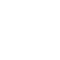
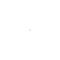
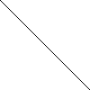
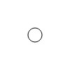
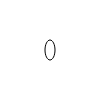
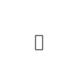
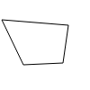
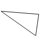
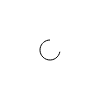

### The Coordinate System

The coordinate system is based on the top-left corner of the sketch and the canvas is 100 pixels wide by 100 pixels high. There are two built-in variables `WIDTH` and `HEIGHT`. To make calculations easier. **You can not change the canvas size!**

### Color and Drawing Functions

Below you see a two tables of all color and drawing functions. As you can see the fill and storke functions take different kinds of color definitions.

| Function | Description | Default |
| :-- | :-- | :-- |
| `fill("white");` | Set fill color for shapes with named color | White (100, 0, 0) |
| `fill("#ffffff");` | Set fill color for shapes with hex color | White (100, 0, 0) |
| `fill(l, c, h);` | Set fill color for shapes | White (100, 0, 0) |
| `fill(l, c, h, a);` | Set fill color with alpha (0-100) | — |
| `noFill();` | Disable fill | — |
| `stroke("black");` | Set stroke (outline) color | Black (0, 0, 0) |
| `stroke("#000000");` | Set stroke (outline) color | Black (0, 0, 0) |
| `stroke(l, c, h);` | Set stroke (outline) color | Black (0, 0, 0) |
| `stroke(l, c, h, a);` | Set stroke color with alpha (0-100) | — |
| `noStroke();` | Disable stroke | — |
| `strokeWidth(weight);` | Set stroke thickness in pixels | 1 |

| Function | Description |
| :-- | :-- |
| `point(x, y);` | Draw a solid round point centered at (x, y) |
| `line(x1, y1, x2, y2);` | Draw line from (x1, y1) to (x2, y2) |
| `rect(x, y, width, height);` | Draw rectangle, (x, y) is top-left corner |
| `circle(x, y, radius);` | Draw circle centered at (x, y) |
| `ellipse(x, y, width, height);` | Draw ellipse centered at (x, y) |
| `triangle(x1, y1, x2, y2, x3, y3);` | Draw triangle with three vertices |
| `quad(x1, y1, x2, y2, x3, y3, x4, y4);` | Draw quadrilateral with four vertices |
| `arc(x, y, radius, startAngle, endAngle);` | Draw open arc (degrees, 0 = right, clockwise) |

### Strokes

Strokes are defined by a color and its width. You can set the color using the `stroke(color)` command. The default is a black stroke with a width of 1px.

```gic
// seee the color section of the documentation to learn more about how to define colors.
stroke("black");
strokeWidth(1);
// without an element to target this sketch actually makes no sense. Therefore we omit an image here.
```

To disable a stroke, you can use the `noStroke()` command.

### Fills

To fill an element with a color you use the `fill(color)` command. The default is a white fill.

```gic
fill("white");
// without an element to target this sketch actually makes no sense. Therefore we omit an image here.
```

to disable a fill, use the `noFill()` command.

### Background

To set the background color of the sketch, use the `background(color)` command. It can be used at any "time" to clear the sketch. This becomes useful in conditional drawing for example. The default sketch background is white.

```gic
background("white");
```



### Points

A point is a single coordinate on the canvas. It is declared using the `point` keyword and gets passed the x and y coordinates as arguments. The points size is controlled by the `strokeWidth(width)` command.

```gic
point(50, 50);
```



### Lines

A line is a straight connection between two points. It is declared using the `line` keyword. It gets passed the x1 and y1 coordinates of the start point and the x2 and y2 coordinates of the end point as arguments.

```gic
line(0, 0, 100, 100);
```



### Circles

A circle is a circular shape. It is declared using the `circle` keyword. It gets passed the x and y coordinates of the center point and the radius as arguments.

```gic
circle(50, 50, 10);
```



### Ellipses

An ellipse is a circular or oval shape. It is declared using the `ellipse` keyword. It gets passed the x and y coordinates of the center point and the width and height as arguments.

```gic
ellipse(50, 50, 10, 20);
```



### Rectangles

A rectangle is a rectangular shape. It is declared using the `rect` keyword. It gets passed the x and y coordinates of the top-left corner and the width and height as arguments.

```gic
rect(50, 50, 10, 20);
```



### Quads

A quad is a quadrilateral shape. It is declared using the `quad` keyword. It gets passed the x1 and y1 coordinates of the first point, the x2 and y2 coordinates of the second point, the x3 and y3 coordinates of the third point, and the x4 and y4 coordinates of the fourth point as arguments.

```gic
quad(50, 50, 100, 50, 100, 100, 50, 100);
```



### Triangles

A triangle is a triangular shape. It is declared using the `triangle` keyword. It gets passed the x1 and y1 coordinates of the first point, the x2 and y2 coordinates of the second point, and the x3 and y3 coordinates of the third point as arguments.

```gic
triangle(2, 22, 76, 28, 70, 70);
```



### Arc

An arc is a curved line segment. It is declared using the `arc` keyword. It gets passed the x and y coordinates of the center, the radius, the start angle, and the end angle as arguments.

```gic
arc(x, y, radius, startAngle, endAngle);
```


